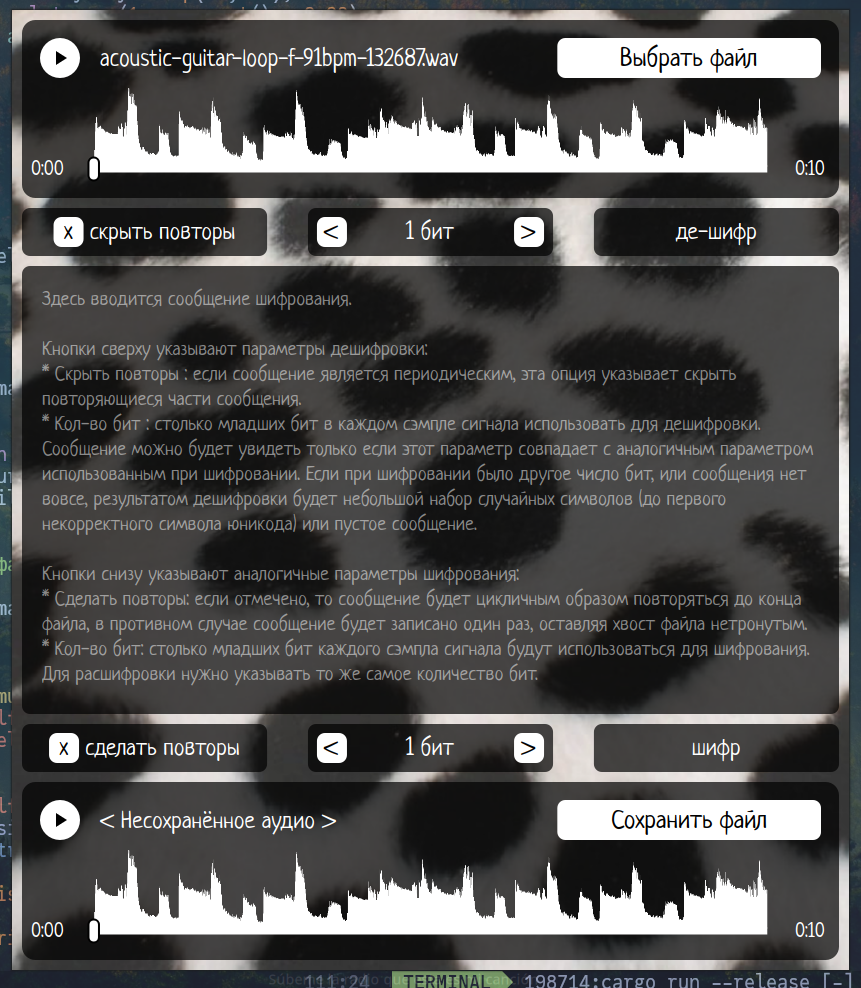

# Wav-wav!

**Wav-wav** is a desktop application developed as an assignment project about audio steganography technique by embedding Unicode text messages into 16-bit WAV audio files using the Least Significant Bits. The project is written in rust and it features a graphical user interface and includes basic audio player.

The interface is in Russian, and if you would like the English version to exist, just open an issue about it.

## What is steganography

Steganography involves concealing information within non-secret data to avoid detection. In the context of audio, this is achieved by modifying the least significant bits of audio samples, a method that typically results in imperceptible changes to the sound quality.

This application focuses on embedding Unicode text messages into 16-bit PCM WAV files by altering several of the least significant bits in each audio sample. The number of bits used can be adjusted to balance between data capacity and audio fidelity.

## Features

The application provides a graphical interface to load a 16-bit WAV file, input a Unicode text message, and embed the message into the audio file using the LSB (Least-Significant-Bit) technique. Users can also extract embedded messages and play audio files to compare original and modified versions.

It features:

* Simple audio player with play/pause button, seeking with a slider, and a waveform display.

* Nice text field for message editing with scrolling for large messages.

* Using from 1 to 8 least significant bits of a signal both in encoding and decoding a message.

* Detecting repetition in the decoded message, showing only one cycle of the message. 

* Encode messages with repetition or just in the begining of the file.

## Implementation notes

* An interface is built using the Slint toolkit (see https://slint.dev/)

* The application supports 16-bit PCM WAV files. It can work with different sample rates, but only supports 16-bit encoding for now.

* Utilizes the `hound` crate for reading and writing WAV files.

* Audio playback implemented with the `rodio` crate.

## Project Name

The name "wav-wav" is a play on words, referencing both the WAV audio format and the Russian onomatopoeia "вав-вав," which mimics a dog's bark. This naming underscores the concept of hiding messages in plain hearing.
